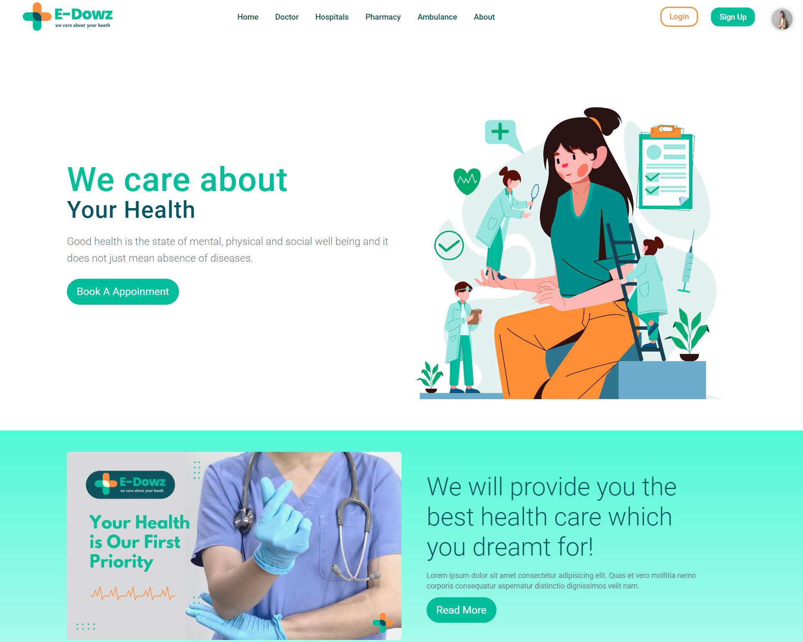
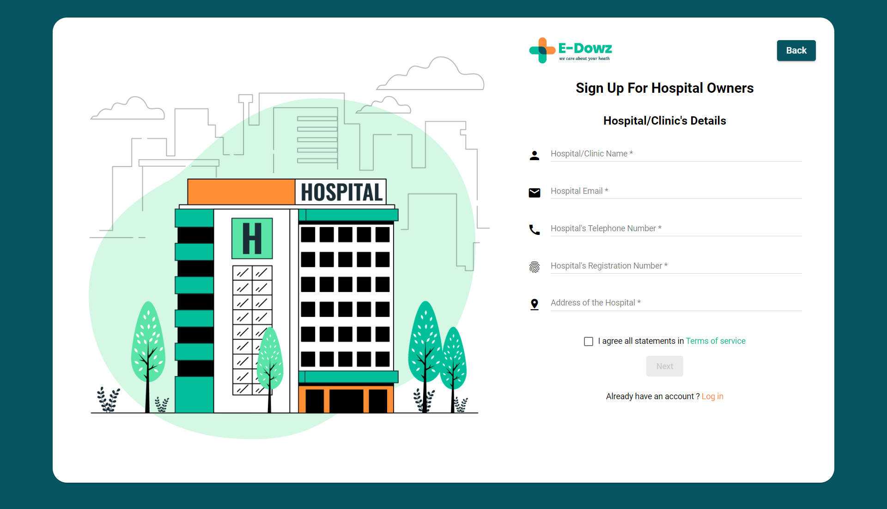

# Edowz Health-Care-Management-System

This is the **frontend** of the Edowz Health Care Management System — a comprehensive platform to streamline the management of hospitals, pharmacies, doctors, and patients.

## 🌐 Project Overview

The Edowz Health-Care-Management-System provides an all-in-one digital solution for healthcare institutions. It aims to reduce administrative overhead, improve patient care, and enhance communication between all stakeholders.

---

## 🛠️ Technologies Used

- **Angular** — Frontend framework
- **Angular Material** — UI Components
- **Bootstrap** — Responsive design
- **Spring Boot** — Backend (separate repository)
- **Java** — Backend language
- **MySQL** — Database

---

## 🚀 Features

- 👨‍⚕️ Doctor registration, profile management & appointments  
- 🏥 Hospital administration interface  
- 💊 Pharmacy inventory and order management  
- 🧑‍🤝‍🧑 Patient dashboard and booking system  
- 🔒 Role-based access control (Admin, Doctor, Patient, Pharmacy)
- 📊 Interactive dashboards using Angular Material

---

## 📸 Some of Screenshots

> Add your screenshots in a `screenshots/` folder and link them here:

|Common Home Page | Doctor Home Page | Hospital Login Page |
|----------|----------------------|----------------|
|  |  |  |

---

## 📌 Notes

- The backend for this system is developed using **Spring Boot** and can be found in the corresponding backend repository.
- MySQL is used to manage persistent data for doctors, patients, appointments, and inventory.

---

## 📫 Contact

If you have any questions or suggestions, feel free to reach out!
